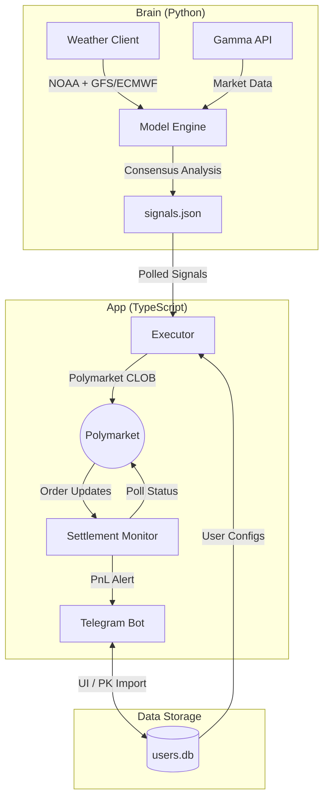

# Blocky Weather Bot: 24/7 Automation Handover

The bot is now a fully autonomous, high-conviction weather trading engine. It scans, analyzes, trades, and alerts you to results 24/7.

## 🏗️ System Architecture & Flow

To help other developers understand the pipeline, here is the architectural breakdown and data flow:



### Data Flow Breakdown
1. **Weather Ingestion**: The Python `Brain` periodically fetches ensemble data (GFS and ECMWF).
2. **Signal Generation**: It matches forecasted temperatures against open Polymarket weather contracts.
3. **Signal I/O**: High-conviction signals (where models agree) are written to `signals.json`.
4. **Execution Loop**: The TypeScript `Executor` reads signals, calculates sizes based on risk settings in `users.db`, and hits the Polymarket CLOB API.
5. **Settlement Polling**: The `Settlement Monitor` watches the blockchain for resolution and triggers the Telegram bot to send Win/Loss alerts.

## Key Accomplishments

### 🌦️ Advanced Signal Analysis
- **Ensemble Consensus**: The bot now requires both **GFS** and **ECMWF** models to agree before placing a trade.
- **Global Reach**: Expanded support to **Tokyo, Paris, Amsterdam, London**, and other major international markets using precise station coordinates.
- **Edge Calculation**: Automatically calculates the advantage over market prices using Z-Score probability logic.

### 💸 Autonomous Trading Loop
- **Smart Sizing**: Trade sizes are automatically calculated based on your `/set_risk` percentage and `/set_max` dollar amount.
- **Execution**: The `executor.ts` script polls for signals every 2 minutes and places limit orders via the CLOB API.
- **Anti-Double-Trade**: Built-in logic ensures the bot only trades each signal once per user.

### 🔔 Settlement & Reporting
- **Real-Time Alerts**: The `settlement.ts` monitor polls Polymarket for market resolutions.
- **Win/Loss Notification**: You will receive a Telegram message the moment your trade settles (e.g., "WIN ✅ PnL: +12.50 USDC").
- **Performance Dashboard**: Use the new **`/stats`** command to see your total win rate and PnL.

## How to Run 🚀

To start the entire autonomous pipeline (Signals + Bot + Executor + Settlement):

```bash
npm start
```

## Security & Maintenance
- **Credentials**: Your API keys are derived securely from your Private Key and stored locally. Use `/remove_wallet` to wipe your data at any time.
- **Logs**: Monitor the terminal for `[EXEC]` and `[SETTLE]` logs to see the bot's background heartbeats.

> [!IMPORTANT]
> The bot requires the `.env` file to be populated with your `TELEGRAM_BOT_TOKEN`. Ensure this is set before running.

---
**Your bot is now deployed and ready to crush the weather markets. Good luck!** 🌡️📉💰
